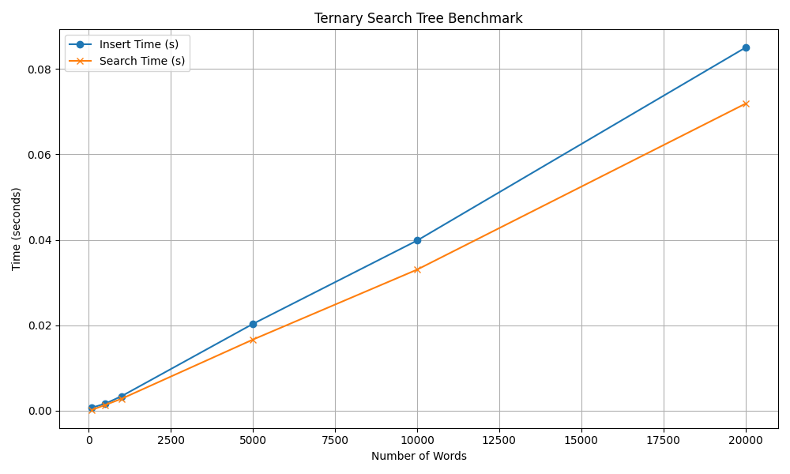

# 🌲 Ternary Search Tree (TST) — Implementation & Benchmarking

This project implements a *Ternary Search Tree (TST)* from scratch in Python and benchmarks its performance across varying word list sizes. Benchmarking was executed on *Local* as well as on the *KU Leuven Tier-2 HPC - wICE cluster*.

---

## 🧠 Project Goals

- Build a character-efficient Ternary Search Tree
- Benchmark insert and search operations at scale
- Use VSC's HPC to evaluate performance under large inputs
- Project contains a `screenshots` folder to show screenshots from HPC

---

## 🗂️ Directory Structure

```bash

├── data/                          # Input dictionary (word list)
├── screenshots/
│   ├── benchmark_plot.png
│   ├── benchmark_plot_exported.png
│   ├── output.png
│   ├── server_directory.png
├── main_job.slurm                # SLURM job script for HPC
├── tst_benchmark.py              # Benchmarking script
├── ternary_search_tree.ipynb     # Usage + test notebook
├── ternary_search_tree.py        # Actual implementation og TST

```

---


## Example Usage

```bash

from ternary_search_tree import TernarySearchTree

tst = TernarySearchTree()

# Insert words
tst.insert("cat")
tst.insert("can")
tst.insert("cab")

# Exact search
print(tst.search("cat", exact=True))  # True
print(tst.search("ca", exact=True))   # False

# Prefix search
print(tst.search("ca", exact=False))  # True

.insert(word) — adds a word to the tree
.search(word, exact=True) — checks for an exact match
.search(word, exact=False) — checks if it's a prefix of any stored word

```

---

## Benchmark results

The benchmark script evaluates performance for increasing word counts **(100–20,000)**. The result:

Both insert and search operations scale linearly with input size.

## Running Benchmarks on HPC (SLURM)

The benchmarking was run on wICE cluster on KU Leuven HPC. The script used calls `tst_benchmark.py` to run the benchmarking and plots the result to `benchmark_plot.png`

### Job script used

```bash

#!/bin/bash
#SBATCH --job-name=benchmark_test
#SBATCH --output=output_%j.txt
#SBATCH --error=error_%j.txt
#SBATCH --time=00:30:00
#SBATCH --mem=4G
#SBATCH --ntasks=1

# Load libraries
module load cluster/wice/interactive
module load matplotlib/3.9.2-gfbf-2024a


# Run your benchmark script
python tst_benchmark.py

```

### Benchmark plot (exported from server)



### Sample output

```bash

SLURM_JOB_ID: 64547222
SLURM_JOB_USER: vsc37565
SLURM_JOB_ACCOUNT: lp_h_ds_students
SLURM_JOB_NAME: benchmark_test
SLURM_CLUSTER_NAME: wice
SLURM_JOB_PARTITION: batch
SLURM_NNODES: 1
SLURM_NODELIST: r33c22n4
SLURM_JOB_CPUS_PER_NODE: 2
Date: Mon May 26 02:23:07 CEST 2025
Walltime: 00-00:30:00
========================================================================
Benchmark completed and plot saved.

```

## Conclusion

This project showcases a full pipeline from data structure design to performance evaluation at scale. By implementing the Ternary Search Tree from scratch and rigorously benchmarking it on a high-performance computing cluster, we demonstrate not only the theoretical efficiency of TSTs but also their practical behavior under real workloads. The work reflects a hands-on understanding of algorithmic thinking, Python performance profiling, and cluster-based experimentation — tying together systems, structures, and scalability.

Muhammad Abdul Rehman - 2470126
Muhammad Umair - 2469710
